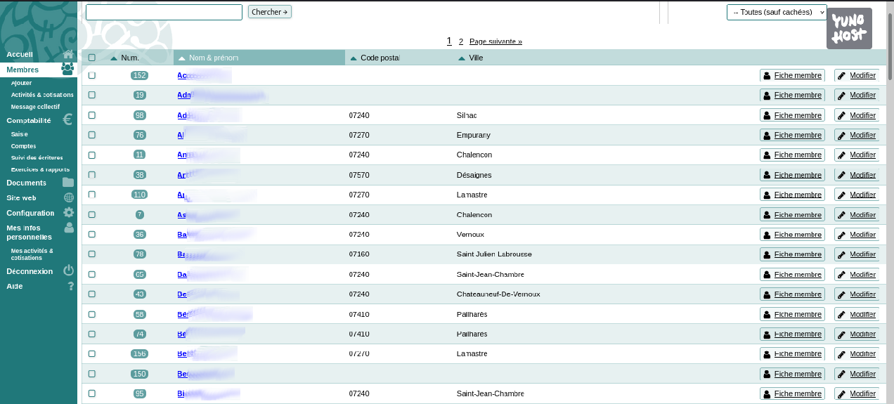

<!--
Nota bene : ce README est automatiquement généré par <https://github.com/YunoHost/apps/tree/master/tools/readme_generator>
Il NE doit PAS être modifié à la main.
-->

# Paheko pour YunoHost

[](https://dash.yunohost.org/appci/app/paheko)  

[](https://install-app.yunohost.org/?app=paheko)

*[Lire le README dans d'autres langues.](./ALL_README.md)*

> *Ce package vous permet d’installer Paheko rapidement et simplement sur un serveur YunoHost.*  
> *Si vous n’avez pas YunoHost, consultez [ce guide](https://yunohost.org/install) pour savoir comment l’installer et en profiter.*

## Vue d’ensemble

Paheko (mot de la langue Māori qui signifie « coopérer », illustrant le but du logiciel : améliorer ensemble le quotidien de la gestion d'une association) est un logiciel de gestion associative. Il est l'outil de prédilection pour gérer une association, un club sportif, une ONG, etc. Il est conçu pour répondre aux besoins d'une structure de petite à moyenne taille : gestion des adhérents, comptabilité, site web, prise de notes en réunion, archivage et partage des documents de fonctionnement de l'association, discussion entre adhérents.


**Version incluse :** 1.3.6~ynh2

**Démo :** <https://paheko.cloud/essai/>

## Captures d’écran



## Documentations et ressources

- Site officiel de l’app : <https://paheko.cloud>
- Documentation officielle de l’admin : <https://fossil.kd2.org/paheko/wiki?name=Documentation>
- Dépôt de code officiel de l’app : <https://fossil.kd2.org/paheko/dir?ci=tip>
- YunoHost Store : <https://apps.yunohost.org/app/paheko>
- Signaler un bug : <https://github.com/YunoHost-Apps/paheko_ynh/issues>

## Informations pour les développeurs

Merci de faire vos pull request sur la [branche `testing`](https://github.com/YunoHost-Apps/paheko_ynh/tree/testing).

Pour essayer la branche `testing`, procédez comme suit :

```bash
sudo yunohost app install https://github.com/YunoHost-Apps/paheko_ynh/tree/testing --debug
ou
sudo yunohost app upgrade paheko -u https://github.com/YunoHost-Apps/paheko_ynh/tree/testing --debug
```

**Plus d’infos sur le packaging d’applications :** <https://yunohost.org/packaging_apps>
